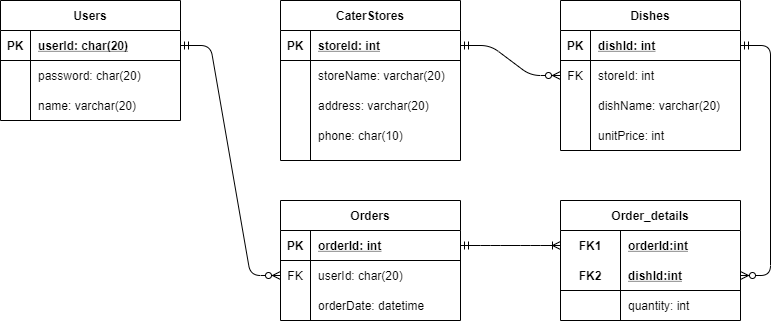

# homework_week2
----
##### 訂便當資料庫系統

以下是各資料表欄位描述:

Users: 記錄使用者資訊
| 欄位 | 描述 |
|----|----|
|userId|使用者帳號|
|password|使用者密碼|
|name|使用者名稱|

CaterStores: 記錄便當店資訊
| 欄位 | 描述 |
|----|----|
| storeId | 便當店編號 |
| storeName | 便當店名稱 |
| address | 便當店地址 |
| phone | 便當店聯絡電話 |

Dishes: 記錄餐點資訊
| 欄位 | 描述 |
| ---- | ---- |
| dishId | 餐點編號 |
| storeId | 屬於哪一間便當店 |
| dishName | 餐點名稱 |
| unitPrice | 單價 |

Orders: 訂單資訊
|欄位|描述|
|----|----|
| orderId | 訂單編號 |
| userId | 是哪一位使用者訂的 |
| orderDate | 下訂單的時間 |

Order_details: 訂單明細
| 欄位 | 描述 |
|----|----|
| orderId | 訂單編號 |
| dishId | 餐點編號 |
| quantity | 數量 |